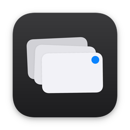
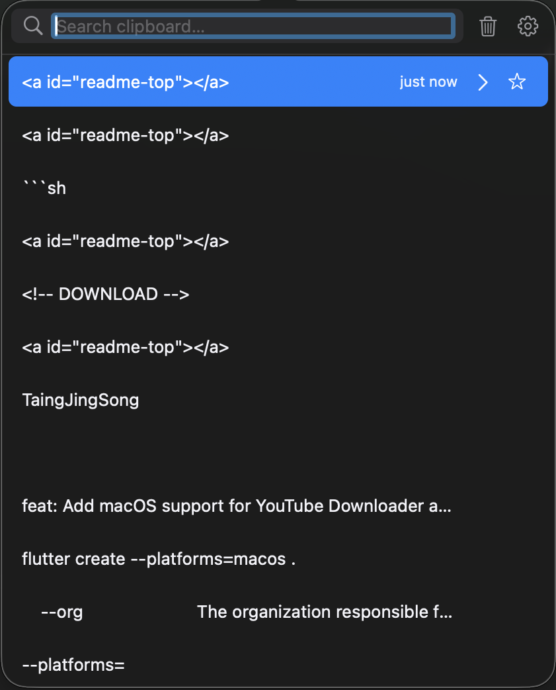

<a id="readme-top"></a>

<!-- PROJECT SHIELDS -->
[![Release][release-shield]][release-url]
[![Downloads][downloads-shield]][downloads-url]
[![CI][ci-shield]][ci-url]
[![macOS][platform-shield]][platform-url]
[![React Native macOS][rn-macos-shield]][rn-macos-url]
[![MIT License][license-shield]][license-url]

<!-- PROJECT LOGO -->
<br />
<div align="center">
  <a href="https://github.com/TaingJingSong/pastey">
    
  </a>

  <h1 align="center">Pastey</h1>

  <p align="center">
    A lightweight, private clipboard manager for macOS, built with React Native macOS and native Swift modules.
    <br />
    <br />
    <a href="https://github.com/TaingJingSong/pastey/releases/latest"><strong>Download</strong></a>
    ·
    <a href="CHANGELOG.md">Changelog</a>
    ·
    <a href="https://github.com/TaingJingSong/pastey/issues/new?labels=bug">Report a Bug</a>
    ·
    <a href="https://github.com/TaingJingSong/pastey/issues/new?labels=enhancement">Request a Feature</a>
  </p>
</div>

<!-- SCREENSHOT -->
<div align="center">
  
</div>

---

<!-- TABLE OF CONTENTS -->
<details>
  <summary>Table of Contents</summary>
  <ol>
    <li><a href="#about">About</a>
      <ul>
        <li><a href="#features">Features</a></li>
        <li><a href="#built-with">Built With</a></li>
      </ul>
    </li>
    <li><a href="#installation">Installation</a>
      <ul>
        <li><a href="#system-requirements">System Requirements</a></li>
        <li><a href="#download">Download</a></li>
        <li><a href="#first-launch-warning">First-launch warning</a></li>
        <li><a href="#verifying-your-download">Verifying your download</a></li>
        <li><a href="#uninstalling">Uninstalling</a></li>
      </ul>
    </li>
    <li><a href="#usage">Usage</a>
      <ul>
        <li><a href="#keyboard-shortcuts">Keyboard Shortcuts</a></li>
        <li><a href="#presentation-modes">Presentation Modes</a></li>
        <li><a href="#preview-panel">Preview Panel</a></li>
        <li><a href="#window-resizing">Window Resizing</a></li>
      </ul>
    </li>
    <li><a href="#data-and-privacy">Data and Privacy</a></li>
    <li><a href="#architecture">Architecture</a></li>
    <li><a href="#building-from-source">Building from Source</a>
      <ul>
        <li><a href="#prerequisites">Prerequisites</a></li>
        <li><a href="#setup">Setup</a></li>
        <li><a href="#running">Running</a></li>
        <li><a href="#tests">Tests</a></li>
        <li><a href="#release-build">Release Build</a></li>
      </ul>
    </li>
    <li><a href="#troubleshooting">Troubleshooting</a></li>
    <li><a href="#roadmap">Roadmap</a></li>
    <li><a href="#contributing">Contributing</a></li>
    <li><a href="#security">Security</a></li>
    <li><a href="#license">License</a></li>
    <li><a href="#acknowledgments">Acknowledgments</a></li>
  </ol>
</details>

---

<!-- ABOUT -->
## About

Pastey sits in the menu bar, watches your clipboard, and gives you back anything you've copied recently — searchable, previewable, and re-pasteable from a global hotkey.

Most clipboard managers on macOS are either Electron apps using 200 MB of RAM or paid closed-source utilities. Pastey is a smaller alternative: a React Native macOS UI over native Swift modules for the parts that need to feel native — the pasteboard watcher, the global hotkey, the menu bar item, and the popover.

It runs as an accessory application, so there's no dock icon and no Cmd-Tab entry. It also skips pasteboards marked as concealed by password managers, so 1Password and Bitwarden copies don't end up in your history.

### Features

- **Menu bar only** — no dock icon, no Cmd-Tab entry
- **Global hotkey** — ⌘⇧V by default; four presets in Preferences
- **Two presentation modes** — attached to the menu bar, or floating at the cursor
- **Live-resizable window** — drag edges or corners; size persists across launches
- **Search** — filters previews and full text as you type
- **Text and images** — PNGs are saved to Application Support
- **Preview panel** — full content side-by-side; flips to the left at screen edges
- **Pin and expire** — pinned items stay; unpinned items capped by count and age
- **Privacy filter** — skips password manager pasteboards and user-excluded apps
- **Native appearance** — System, Light, and Dark follow macOS `NSAppearance`
- **Launch at login** — `SMAppService` on macOS 13+, `LaunchAgents` on older
- **Fully local** — no network requests, no telemetry, no analytics

<p align="right">(<a href="#readme-top">back to top</a>)</p>

### Built With

- [React Native macOS](https://github.com/microsoft/react-native-macos)
- [Swift](https://swift.org) / AppKit
- [SQLite](https://www.sqlite.org)
- [Zustand](https://github.com/pmndrs/zustand)
- [Shopify FlashList](https://github.com/Shopify/flash-list)

<p align="right">(<a href="#readme-top">back to top</a>)</p>

---

<!-- INSTALLATION -->
## Installation

### System Requirements

| Requirement | Details |
| :--- | :--- |
| Operating system | macOS 11.0 (Big Sur) or later |
| Architecture | See the [Releases page](https://github.com/TaingJingSong/pastey/releases/latest) for the architectures each build supports |

### Download

Grab the latest `.dmg` from the [Releases page](https://github.com/TaingJingSong/pastey/releases/latest).

1. Open the DMG and drag **Pastey** to your Applications folder.
2. Launch it from Spotlight or Finder.

### First-launch warning

Pastey isn't signed with a paid Apple Developer certificate, so macOS will refuse to open it the first time. You'll see a dialog saying "Apple could not verify Pastey is free of malware."

To open it anyway:

1. Click **Done** on the warning (do not click "Move to Trash").
2. Open **System Settings** → **Privacy & Security**.
3. Scroll to the **Security** section.
4. Click **Open Anyway** next to the message about Pastey.
5. Confirm by clicking **Open**.

You only need to do this once.

The reason is that Apple charges $99/year for the Developer Program, which is what notarization requires. For a personal project, that's not worth the cost. If you'd rather not trust a downloaded binary, the source is right here — see [Building from Source](#building-from-source).

### Verifying your download

Because the app is unsigned, you may want to confirm the DMG is the one published on the Releases page. Compare its SHA-256 checksum with the value listed in the release notes:

```sh
shasum -a 256 ~/Downloads/Pastey-<version>.dmg
```

### Uninstalling

1. Quit Pastey from the menu bar (right-click the status icon → **Quit**, or <kbd>⌘</kbd> <kbd>Q</kbd>).
2. Delete **Pastey** from your Applications folder.
3. Optional — remove your clipboard history and settings:

```sh
rm -rf ~/Library/Application\ Support/Pastey
defaults delete com.pastey.Pastey
```

If you enabled **Launch at login** on macOS 12 or earlier, also disable it in Preferences before uninstalling so the `LaunchAgents` entry is removed.

<p align="right">(<a href="#readme-top">back to top</a>)</p>

---

<!-- USAGE -->
## Usage

### Keyboard Shortcuts

| Shortcut | Action |
| :--- | :--- |
| <kbd>⌘</kbd> <kbd>⇧</kbd> <kbd>V</kbd> | Toggle history (default global hotkey) |
| <kbd>↑</kbd> / <kbd>↓</kbd> | Move selection up and down |
| <kbd>⏎</kbd> | Copy selected item and hide |
| <kbd>⎋</kbd> | Close preview panel, or dismiss Pastey |
| <kbd>⌘</kbd> <kbd>,</kbd> | Open Preferences |
| <kbd>⌘</kbd> <kbd>W</kbd> | Close Preferences |
| <kbd>⌘</kbd> <kbd>Q</kbd> | Quit Pastey |

### Presentation Modes

Pastey can show up in two places, switchable under **Preferences → Show history at**:

- **Menu bar** — a popover anchored to the status icon. This is the default. Right-click the status icon for Show, Preferences, and Quit.
- **Mouse position** — a floating panel that appears near the cursor, constrained to the active display.

### Preview Panel

Hovering over an item for two seconds, or clicking its `›` button, opens a side panel with the full content. Long text gets a monospaced view with line and character counts; images scale to fit. The panel flips to the left side of the history window if there's no room on the right.

### Window Resizing

In mouse-position mode, drag the panel's edges or corners to resize (min 320×360, max 900×1200). The size is remembered across launches. Reset to the default 420×520 from Preferences.

<p align="right">(<a href="#readme-top">back to top</a>)</p>

---

<!-- DATA AND PRIVACY -->
## Data and Privacy

Everything stays on your Mac. No network requests, no telemetry, no analytics.

| What | Where |
| :--- | :--- |
| Database | `~/Library/Application Support/Pastey/pastey.db` |
| Images | `~/Library/Application Support/Pastey/images/` |
| Settings | `NSUserDefaults` under `com.pastey.Pastey` |

Pastey checks the pasteboard for three markers before saving a copy: `org.nspasteboard.ConcealedType`, `org.nspasteboard.TransientType`, and `org.nspasteboard.AutoGeneratedType`. Password managers set these, so their clipboard entries are skipped automatically. You can also add specific app bundle IDs (e.g. `com.apple.keychainaccess`) to an exclude list in Preferences.

Clipboard history is stored unencrypted in the local SQLite database. Anything not flagged by the markers above, or by your exclude list, will be saved — treat the database file like any other sensitive local file.

<p align="right">(<a href="#readme-top">back to top</a>)</p>

---

<!-- ARCHITECTURE -->
## Architecture

Pastey is split along a native/JavaScript boundary: anything that must integrate tightly with macOS lives in Swift, and everything the user sees and interacts with is React Native.

| Layer | Responsibility |
| :--- | :--- |
| **Native Swift modules** | Pasteboard watcher, global hotkey, menu bar status item, popover and floating panel, launch-at-login, `NSAppearance` sync |
| **React Native macOS UI** | History list (FlashList), search, preview, Preferences |
| **State** | Zustand stores |
| **Persistence** | Embedded SQLite (WAL mode, cascade deletes); images stored as files in Application Support |

The app uses a multi-root React Native setup with three roots: `Pastey` (history), `PasteySettings` (Preferences window), and `PasteyPreview` (preview panel).

<p align="right">(<a href="#readme-top">back to top</a>)</p>

---

<!-- BUILDING FROM SOURCE -->
## Building from Source

### Prerequisites

- macOS 11.0 (Big Sur) or later
- Xcode 14 or later, with Command Line Tools installed (`xcode-select --install`)
- Node.js 18 or later
- CocoaPods

```sh
brew install cocoapods
```

### Setup

```sh
git clone https://github.com/TaingJingSong/pastey.git
cd pastey
npm install
npm run macos:pods
```

### Running

Two terminals:

```sh
# Terminal 1 — Metro bundler
npm start
```

```sh
# Terminal 2 — debug build
npm run macos
```

### Tests

```sh
npm test
```

### Release Build

> Maintainers only — this script commits, tags, pushes, and publishes a GitHub release.

```sh
./scripts/release.sh
```

The release script handles everything: version bump, production JS bundle, `xcodebuild` Release, DMG packaging, git commit, tag, push, and the GitHub release. Run with `--help` for flags.

<p align="right">(<a href="#readme-top">back to top</a>)</p>

---

<!-- TROUBLESHOOTING -->
## Troubleshooting

**macOS says Pastey "could not be verified" or won't open.**
This is expected for the first launch of an unsigned app. Follow the steps in [First-launch warning](#first-launch-warning).

**The global hotkey does nothing.**
Another app may already be using ⌘⇧V. Pick one of the other presets under **Preferences**, or quit the conflicting app.

**Something I copied from a password manager isn't in my history.**
That's intentional. Pastey skips pasteboards flagged as concealed, transient, or auto-generated. See [Data and Privacy](#data-and-privacy).

**I want to stop Pastey from recording a specific app.**
Add the app's bundle ID to the exclude list under **Preferences**.

**The Metro bundler or Pods fail when building from source.**
Make sure Xcode Command Line Tools are installed, then re-run `npm install` and `npm run macos:pods`. If it still fails, [open an issue](https://github.com/TaingJingSong/pastey/issues/new?labels=bug) with your macOS, Xcode, and Node versions.

<p align="right">(<a href="#readme-top">back to top</a>)</p>

---

<!-- ROADMAP -->
## Roadmap

Done:

- [x] Menu bar accessory app with configurable global hotkey
- [x] Menu bar popover and mouse-position panel
- [x] Multi-root React Native architecture (`Pastey`, `PasteySettings`, `PasteyPreview`)
- [x] Embedded SQLite with WAL mode and cascade deletes
- [x] Image capture with local file management
- [x] Resizable history window with persisted dimensions
- [x] Preview panel with edge-collision handling
- [x] Search across preview and full text
- [x] Excluded-app filter for sensitive bundle IDs
- [x] Theme sync with `NSAppearance`
- [x] Launch at login via `SMAppService` and `LaunchAgents`
- [x] Settings window with sidebar navigation and SF Symbols

Planned:

- [ ] Quick-copy shortcuts (⌘1 – ⌘9)
- [ ] Rich text and HTML clip preview
- [ ] Export and import

See [open issues](https://github.com/TaingJingSong/pastey/issues) for discussion.

<p align="right">(<a href="#readme-top">back to top</a>)</p>

---

<!-- CONTRIBUTING -->
## Contributing

Bug reports and pull requests are welcome. For larger changes, open an issue first so we can agree on the approach before you spend time on it.

1. Fork the repository
2. Create a branch (`git checkout -b feature/thing`)
3. Make your changes
4. Run `npm test` and `npm run lint`
5. Open a pull request

When reporting a bug, please include your macOS version, Pastey version, and steps to reproduce. By participating in this project you agree to follow the [Code of Conduct](CODE_OF_CONDUCT.md). See [CONTRIBUTING.md](CONTRIBUTING.md) for the full guidelines.

<p align="right">(<a href="#readme-top">back to top</a>)</p>

---

<!-- SECURITY -->
## Security

Please do **not** report security vulnerabilities in public issues. Use GitHub's [private vulnerability reporting](https://github.com/TaingJingSong/pastey/security/advisories/new) instead. See [SECURITY.md](SECURITY.md) for details and supported versions.

<p align="right">(<a href="#readme-top">back to top</a>)</p>

---

<!-- LICENSE -->
## License

MIT. See [LICENSE](LICENSE) for details.

---

<!-- ACKNOWLEDGMENTS -->
## Acknowledgments

- [React Native macOS](https://github.com/microsoft/react-native-macos)
- [Shopify FlashList](https://github.com/Shopify/flash-list)
- [Zustand](https://github.com/pmndrs/zustand)
- [Best-README-Template](https://github.com/othneildrew/Best-README-Template)
- [Shields.io](https://shields.io)

<p align="right">(<a href="#readme-top">back to top</a>)</p>

<!-- MARKDOWN LINKS -->
[release-shield]: https://img.shields.io/github/v/release/TaingJingSong/pastey?style=for-the-badge
[release-url]: https://github.com/TaingJingSong/pastey/releases/latest
[downloads-shield]: https://img.shields.io/github/downloads/TaingJingSong/pastey/total?style=for-the-badge
[downloads-url]: https://github.com/TaingJingSong/pastey/releases
[ci-shield]: https://img.shields.io/github/actions/workflow/status/TaingJingSong/pastey/ci.yml?branch=main&style=for-the-badge&label=CI
[ci-url]: https://github.com/TaingJingSong/pastey/actions/workflows/ci.yml
[platform-shield]: https://img.shields.io/badge/platform-macOS%2011.0%2B-000000.svg?style=for-the-badge&logo=apple&logoColor=white
[platform-url]: https://apple.com/macos
[rn-macos-shield]: https://img.shields.io/badge/React%20Native%20macOS-0.76.3-20232A.svg?style=for-the-badge&logo=react&logoColor=61DAFB
[rn-macos-url]: https://github.com/microsoft/react-native-macos
[license-shield]: https://img.shields.io/badge/License-MIT-F5A623.svg?style=for-the-badge
[license-url]: LICENSE